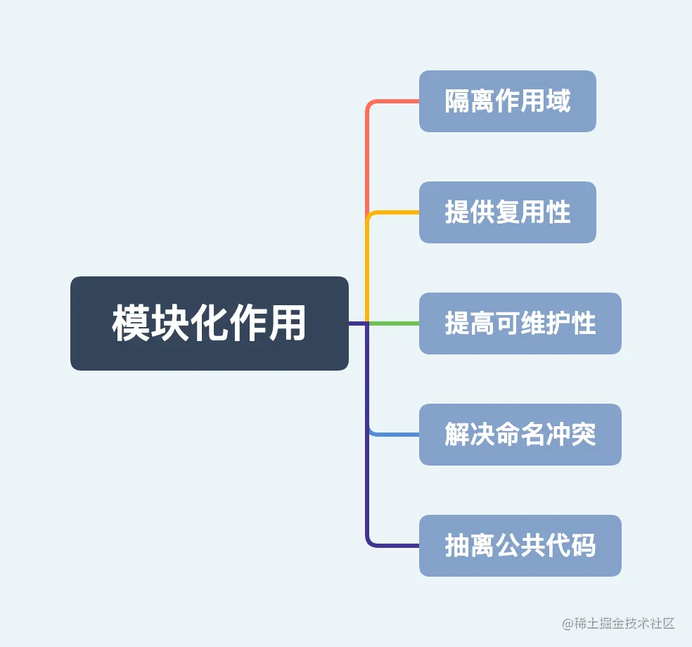
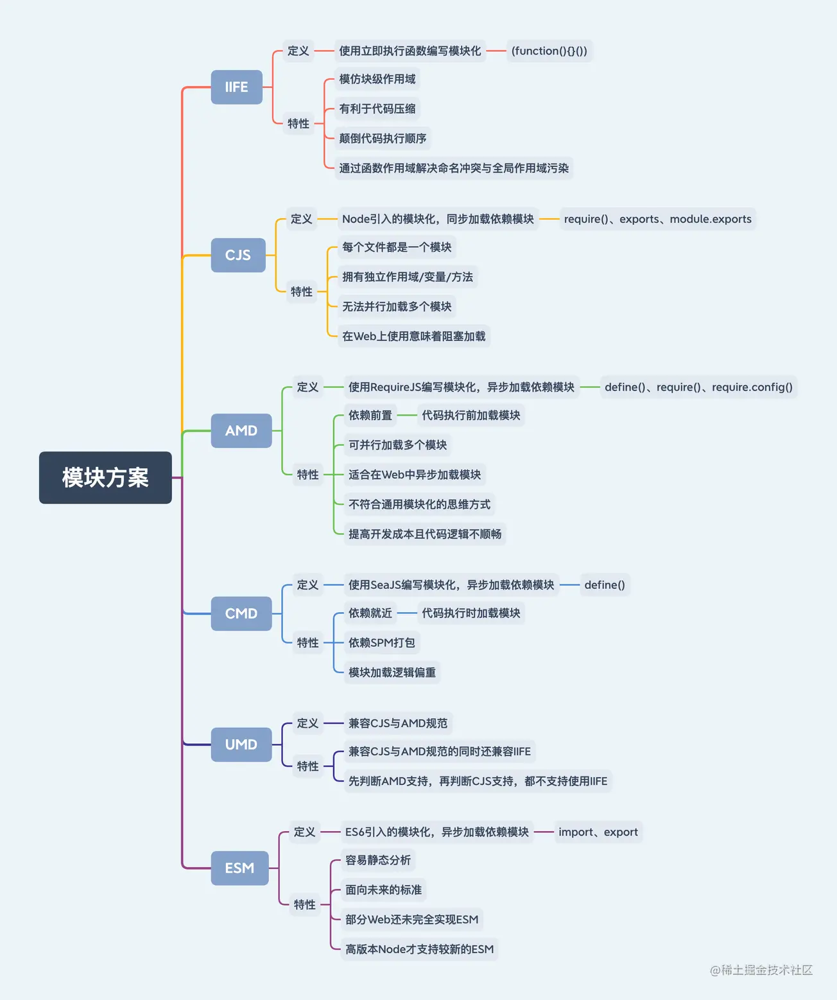

### 模块化
> 目前Web开发倾向于ESM，Node开发倾向于CJS

在实际开发中，一个模块就是一个文件。模块化的核心包括以下特性，基本都是围绕如何处理文件(模块)。
- 拆分：将代码根据功能拆分为多个可复用模块
- 加载：通过指定方式加载模块并执行与输出模块
- 注入：将一个模块的输出注入到另一个模块
- 管理：因为工程模块数量众多需管理模块间的依赖关系


### 模块方案
在JS发展历程中，主要有六种常见模块方案，分别是IIFE、CJS、AMD、CMD、UMD和ESM




| |CJS|ESM|
|--|--|--|
|语法类型|动态|静态|
|关键声明|require|export与import|
|加载方式|运行时加载|编译时加载|
|加载行为|同步加载|异步加载|
|书写位置|任何位置|顶层位置|
|指针指向|this指向当前模块|this指向undefined|
|执行顺序|首次引用时加载模块,再次引用时读取缓存|引用时生成只读引用,执行时才是正式取值
|属性引用|基本类型属于复制不共享,引用类型属于浅拷贝且共享|所有类型属于动态只读引用|
|属性修改|工作空间可修改引用的值|工作空间不可修改引用的值,但可通过引用的方法修改|

加载方式与行为
- 运行时加载: 指整体加载模块生成一个对象，再从对象上获取所需的属性方法去加载。最大特性是全部加载，只有运行时才能得到该对象，无法在编译时做静态优化。
- 编译时加载: 指直接从模块中获取所需的属性方法去加载。最大特性是**按需加载**，在编译时就完成模块加载，效率比其他方案高，无法引用模块本身(本身不是对象)，但可拓展JS高级语法(宏与类型校验)。

### Node环境运行esm
1. --experimental-modules特性
    - 使用type指定模块方案
        - 在package.json中指定type为commonjs，则使用CJS
        - 在package.json中指定type为module，则使用ESM
    - 支持新文件后缀.cjs
        - 文件后缀使用.cjs，则使用CJS
    - 使用--es-module-specifier-resolution指定文件名称引用方式
        - 命令中增加参数--es-module-specifier-resolution=explicit，则引用模块时必须使用文件后缀(默认)
        - 命令中增加参数 --es-module-specifier-resolution=node，则引用模块时无需使用文件后缀
    - 使用main根据type指定模块方案加载文件
        - 在package.json中指定main后会根据type指定模块方案加载文件
    
1. CJS/ESM判断方式
    - mjs文件使用ESM解析
    - cjs文件使用CJS解析
    - js文件使用基于package.json指定的type解析(type=commonjs使用CJS，type=module使用ESM)。

### 方案：部署Node的ESM开发环境
1. Node原生部署方案,v13.2.0以上版本node
    1. 在package.json中指定type为module
    1. 指定Node/Npm版本限制
        ```js
        {
            "type": "module",
            "engines": {
                "node": ">=13.2.0",
                "npm": ">=6.13.1"
            }
        }
        ```
    1. 高版本Node在默认情况下对import命令的文件后缀存在强制性,增加--es-module-specifier-resolution=node解决文件名称问题
        ```js
        {
            "scripts": {
                "start": "node --es-module-specifier-resolution=node src/index.js"
            }
        }
        ```
    1. 特别差异
        ```js
        import { readFileSync } from "fs";
        import { dirname } from "path";
        import { fileURLToPath } from "url";

        const __filename = fileURLToPath(import.meta.url);
        const __dirname = dirname(__filename);

        // 读取json
        const json = readFileSync("./info.json");
        const info = JSON.parse(json);
        ```
1. Node编译部署方案

    1. 用babel将代码从ESM转换为CJS，需要的子包
        - @babel/cli：提供支持@babel/core的命令运行环境
        - @babel/core：提供转译函数
        - @babel/preset-env：提供预设语法转换集成环境
        - @babel/node：提供支持ESM的命令运行环境
    1. 运行
        ```js
        {
            "scripts": {
                "start": "babel-node src/index.js"
            },
            "babel": {
                "presets": [
                    "@babel/preset-env"
                ]
            }
        }
        ```

### 监听脚本自动重启命令

nodemon是一个自动检测项目文件发生变化就重启服务的Npm模块, 上例中执行`nodemon -x babel-node src/index.js`
```js
{
    "nodemonConfig": {
        "env": {
            "NODE_ENV": "dev"
        },
        // 设置运行服务的后缀名与对应的命令
        "execMap": {
            "js": "node --harmony"
        },
        // 监控指定后缀名的文件
        "ext": "js json",
        "ignore": [
            "dist/"
        ],
        "watch": [
            "src/"
        ]
    }
}
```